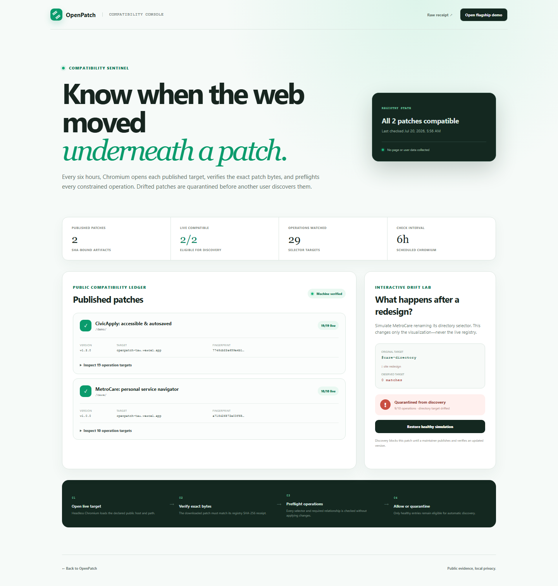
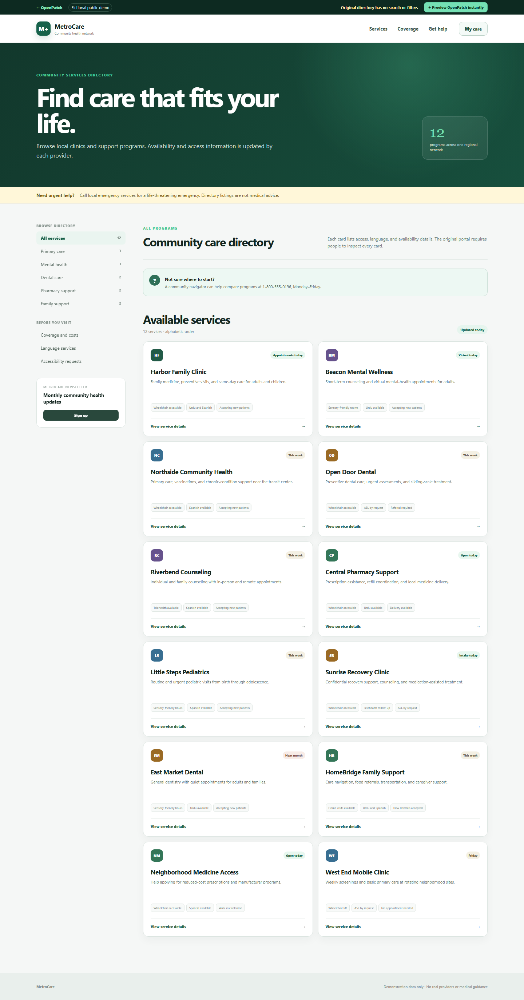
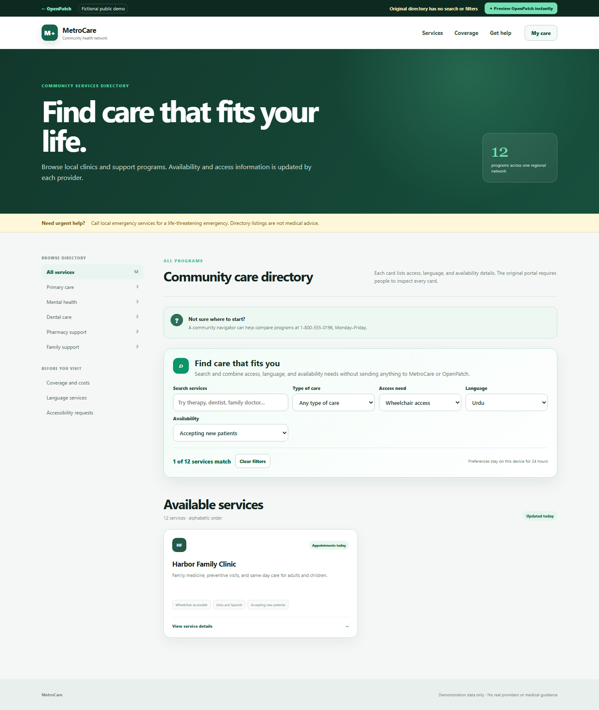
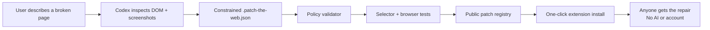

# Patch the Web

[](https://github.com/abbasaliii/patch-the-web/actions/workflows/ci.yml) [](https://github.com/abbasaliii/patch-the-web/actions/workflows/compatibility-monitor.yml)

**Fix the web you have.**

Patch the Web is a safe, public feature layer for websites users do not own. A user shows Codex a missing capability or inaccessible workflow and gets a constrained, domain-scoped patch. Everyone else can install that community upgrade with one click—without AI, an account, or an API key.

Built for OpenAI Build Week 2026 with Codex and GPT‑5.6.

**Live product:** [patch-the-web.vercel.app](https://patch-the-web.vercel.app/) · [Guided installer](https://patch-the-web.vercel.app/install/) · [Repair request pipeline](https://patch-the-web.vercel.app/requests/) · [Public registry](https://patch-the-web.vercel.app/registry/index.json) · [Compatibility Sentinel](https://patch-the-web.vercel.app/registry/compatibility.json)

## The demo

The flagship MetroCare demo is deliberately not a broken toy. It is a credible healthcare directory that works as its owner designed it—but forces a person to inspect twelve cards to compare access, language, availability, and type of care. The site is missing the feature that person actually needs.

Patch the Web’s community patch adds a complete find-and-compare workspace using eleven declarative operations:

- Search existing services using only declared `data-*` attributes
- Combine type-of-care, access, language, and availability filters
- Reduce “wheelchair access + Urdu + accepting new patients” to one matching provider
- Select two or three providers and compare care type, access, language, and availability side by side
- Announce result counts through an ARIA live region
- Support `/` to focus search and Escape to clear
- Preserve only the user’s filter preferences locally for 24 hours
- Send no filter, page, or health data over the network
- Improve the desktop and 390px workflow without replacing the portal’s real links

The original CivicApply proof remains in the registry as a second repair. Its 19 constrained operations repair mobile layout, save non-sensitive form progress, restore drafts after a simulated reset, add accessible validation and keyboard navigation, move human help into the workflow, and remove an obstructive survey.

The registry now also contains a repair authored from a real privacy-safe extension brief on FAST-NUCES's public degree-program page. The complaint was simple: **"I only want to see programs for Karachi."** Codex inspected the live table and authored a domain-scoped `tableColumnFilter` patch. On the current page it keeps 22 Karachi offerings, removes 15 irrelevant rows, collapses six campus columns to Programs + Karachi, and fits the real 390px page without horizontal overflow. The live workspace monitor reports 4/4 healthy operations and a stable structural fingerprint.

| Real university page before | Same live page after the community repair |
| --- | --- |
|  |  |

On any page without a community patch, the extension can also create a **privacy-safe Repair Brief** for Codex. It includes the exact origin and path, viewport geometry, structural counts, accessibility signals, and bounded selector candidates—but never field values, cookies, storage, URL queries, or page text.

Patch the Web v0.7 makes that missing-feature story substantially deeper. Its trusted `collectionCompare` primitive creates the selection controls, live status, bounded tray, and accessible comparison table itself. A patch may name only one exact collection, safe `data-*` attributes, explicit display maps, and a two-to-four item limit. It still cannot provide HTML, JavaScript, callbacks, templates, or URLs.

Patch the Web also closes the community loop and watches it after publication. Open a supported page and the extension discovers its matching repair in the public registry. Before showing the install button, it validates registry metadata and the full DSL, pins the download to the trusted registry origin, confirms the current URL is in scope, verifies the SHA-256 receipt, and preflights every operation against the live DOM. The Compatibility Sentinel opens every published target in Chromium every six hours, records an operation-by-operation structural fingerprint, and quarantines drifted or unreachable patches from discovery. A new workspace-monitor mode fingerprints local patch bytes against the live target before registry publication, so evidence never depends on trusting an already-published artifact.



The flagship validator reports **11/11 healthy operations**, **10/10 publication assertions**, and SHA-256 receipt `14cef4195ec8227fe62c16845fedc683fae1dcb4fd3a752296cef7a1bf9a936c`. Local filter preferences expire automatically after 24 hours.


| Before — twelve cards and no way to express a need | After — one private, accessible match |
| --- | --- |
|  |  |

## Why this is different

User-script tools can already inject arbitrary JavaScript. Patch the Web deliberately cannot.



The patch language supports twelve constrained operation types, including bounded collection filtering/comparison, fail-closed public-table filtering, and local-only search over bounded public tables or lists, alongside allowlisted styles and attributes, explicit hiding, same-page reorganization, non-sensitive form persistence, local validation, and keyboard navigation. It has no operation for scripts, patch-authored HTML, network requests, cookies, or cross-origin data. Trusted collection features can read only explicitly declared `data-*` attributes; public search may read only bounded, non-form row or list text already visible on the page; none can read form values.

## Judge quick start

Requirements for the public demo: Chrome/Chromium 120+. No build, account, credential, or API key is required.

**Recommended path:** use the [guided installer](https://patch-the-web.vercel.app/install/). It walks through downloading, extracting, selecting the correct unpacked folder, pinning the extension, and activating a first repair. The checklist remains on the device and includes fixes for the most common Chrome setup errors.

Prebuilt artifacts:

- [Patch the Web extension v0.15.0](https://patch-the-web.vercel.app/downloads/patch-the-web-extension-v0.15.0.zip) — Chrome extension with automatic repair discovery, confirmed activation, rollback, install recovery, and a guided plain-language repair request
- [Patch the Web Codex plugin v0.4.1](https://patch-the-web.vercel.app/downloads/patch-the-web-codex-plugin-v0.4.1.zip) — validated authoring plugin with structured repair-request support
- Extension SHA-256: `E6C4A6527BF469C8B42305DD4FF42F06DDA6FF6ACAA79C24081D495CEC53179A`
- Plugin SHA-256: `EFD9B788FBC90E6248427F2421B3239DAAF2CE398D550B01CED5390880DD06CF`

Then:

**Zero-install judge preview:** open [the live MetroCare demo](https://patch-the-web.vercel.app/care/) and choose **Preview Patch the Web instantly**. This invokes the same constrained runtime and reports `11/11 healthy`; the steps below verify the real extension distribution path.

1. Download and unzip the public extension artifact above.
2. Open `chrome://extensions`, enable **Developer mode**, choose **Load unpacked**, and select the unzipped folder.
3. Open [the live MetroCare demo](https://patch-the-web.vercel.app/care/).
4. Observe twelve services and no search or filters—the directory works, but cannot express a person’s combined needs.
5. Open the Patch the Web extension. It discovers **MetroCare: personal service navigator**, verifies its registry receipt, shows the scheduled `11/11` live-compatibility result, and independently reports `11/11 operation targets healthy` on your current tab.
6. Choose **Install verified community feature**; the page reloads with the navigator active.
7. Select Harbor Family Clinic and Northside Community Health, then choose **Compare selected**. Patch the Web creates an accessible side-by-side decision table without sending a request.
8. Clear the comparison, choose **Wheelchair access**, **Urdu**, and **Accepting new patients**, and watch the directory reduce to Harbor Family Clinic with `1 of 12 services match`.
9. Reload to see the preferences restored locally; press `/` to focus search. The automated test proves filtering and comparison make zero network requests.
10. Open the Patch the Web extension again and choose **Remove this installed patch** to verify that the feature, enabled state, and installation metadata are removed together.

No account, test credential, API key, or external service is required.

For local development only:

```bash
npm install
npm run build
npm run dev -- --port 5173
```

### Test the Codex authoring path

1. Open any normal website tab that does not have a bundled repair.
2. Open the Patch the Web extension and describe the problem in **Start a repair with Codex**.
3. Choose **Copy Codex repair brief**.
4. Open this repository in Codex and paste the brief. Codex auto-discovers `$patch-the-web-author` from `.agents/skills/patch-the-web-author`.

The same skill is packaged as a distributable Codex plugin under `plugins/patch-the-web`. The extension performs no model call; GPT‑5.6 operates through the user's existing Codex session only while a repair is authored.

People who do not use Codex can start at the guided [repair request page](https://patch-the-web.vercel.app/authors/). It converts plain outcome choices into a privacy-safe `.patch-the-web-request.json` artifact and shows the exact cleaned public text before submission. A guarded serverless intake can create the public request without an account; it is fail-closed until a one-repository Issues-only token and launch switch are configured. The reviewed GitHub path remains available as a fallback. Both paths enter the same automated privacy/structure checks and human maintainer gate before authoring, testing, and registry publication. Every public request can then be tracked through intake, authoring, patch review, and publication on the [repair request pipeline](https://patch-the-web.vercel.app/requests/). See [`REVIEWING_REPAIRS.md`](REVIEWING_REPAIRS.md).


### Test community installation

1. Open the patch's target page.
2. Open the Patch the Web extension. It fetches the machine-readable registry, selects only entries whose declared host and path match the active tab, and downloads only from the trusted registry origin.
3. Inspect the verified registry badge, capabilities, live `11/11` selector preflight, and SHA-256 receipt.
4. Choose **Install verified community feature**, approve Chrome's exact-domain prompt when required, and watch the page reload with the feature active.

For transparent/offline distribution, **Download safe patch** and manual `.patch-the-web.json` import still run through the same independent policy, scope, hash, and live-selector checks.

Imported patches are stored locally, run through the same constrained runtime, and can replace an older version only when their semantic version is equal or newer. Invalid stored entries are ignored rather than executed. Installed community patches can be disabled per domain or removed with their local metadata and any now-unused optional host access.

Verified updates retain at most three prior patch versions on the device. The extension exposes a restore action only for a history entry that still passes DSL validation; restoration then rechecks its exact source receipt, live selector preflight, current page scope, and Chrome domain permission. The replaced version becomes the next restore point, so a user can undo a rollback. Removing a repair deletes its complete version history.

### Supported platforms

- Extension: Chrome/Chromium 120+ on Windows, macOS, and Linux; the release candidate is tested with Playwright Chromium.
- Authoring skill: ChatGPT desktop Codex, Codex CLI, and the Codex IDE extension on platforms that support repository skills.
- Demo and registry: any modern browser; no account, login, API key, or test data required.

## Verification

```bash
npx tsc --noEmit
npm test
npm run validate:patch
npm run test:browser
npm run test:extension
npm run monitor:registry
npm run build
# or run the entire release gate:
npm run verify
```

Current results:

- 80/80 unit, policy, registry-discovery, compatibility-quarantine, preflight, runtime, intake API, and privacy tests pass
- 22/22 desktop and 390px browser journeys pass, including six strict automated WCAG A/AA scans across both patched products, the landing page, and Compatibility Sentinel
- 42/42 mobile and desktop browser journeys pass, including the no-account intake, explicit consent, fallback, public status stages, and strict WCAG A/AA scans
- 8/8 unpacked Manifest V3 extension integration tests pass; the production-only Store build passes all 7 applicable public-domain journeys
- 11/11 flagship constrained operations apply; 19/19 CivicApply operations remain healthy
- 10/10 flagship publication assertions pass; 10/10 CivicApply assertions remain healthy
- Production site and Manifest V3 extension build successfully
- Public `/registry/index.json` and versioned patch download are generated with a SHA-256 receipt
- Public `/registry/compatibility.json` exposes live-page fingerprints and per-operation health; a least-privilege, immutable-action GitHub workflow reruns it every six hours, retries transient failures, retains the full receipt, and promotes only quarantine or recovery transitions

Browser tests prove both product claims: MetroCare starts as a realistic directory with no search, filters, or comparison, then privately combines access needs, compares up to three providers, persists and expires preferences, announces results, supports `/` and Escape, fits mobile, and emits no interaction requests; CivicApply proves full-field draft restoration, exclusion of credential/payment/authentication fields, specific live-clearing accessible errors, first-error focus, and wrapping Arrow/Home/End navigation. Axe audits the fully patched workflows and public product surfaces at WCAG A/AA tags on desktop and mobile, with zero automated violations.

## Repository map

```text
.agents/skills/patch-the-web-author/ Codex patch-authoring workflow, auto-discovered in this repo
.github/workflows/              Clean-install CI and the six-hour Compatibility Sentinel
plugins/patch-the-web/               Distributable Codex plugin package
src/core/                      DSL types, domain matcher, validator, runtime
src/extension/                 Manifest V3 content script, popup, service worker
src/registry/patches/          Versioned community patches
src/site/                      Registry landing page, MetroCare flagship, and CivicApply demo
tests/                         Security, runtime, and browser tests
scripts/                       Build, validation, and preview tooling
```

## Safe transformation DSL

Every patch declares an exact host/path scope, plain-language capabilities, constrained operations, assertions, version, and changelog.

```json
{
  "schemaVersion": 1,
  "id": "org.patchtheweb.civicapply-accessible-draft",
  "match": {
    "hosts": ["patch-the-web.vercel.app"],
    "paths": ["/demo/*"]
  },
  "capabilities": ["local-storage", "validation"],
  "operations": [
    {
      "id": "persist-draft",
      "type": "persistForm",
      "selector": "#benefits-form",
      "key": "housing-support-draft-v1",
      "include": ["input", "select", "textarea"],
      "ttlMinutes": 1440,
      "statusText": "Draft saved on this device for 24 hours"
    }
  ]
}
```

The validator rejects unknown operations, event-handler attributes, network-capable CSS, broad document selectors, malformed scopes, undeclared capabilities, duplicate IDs, excessive operation counts, and sensitive persistence patterns. The runtime adds its own exclusions for password, file, authentication-code, payment, hidden, disabled, and submit fields.

See [`src/core/validator.ts`](src/core/validator.ts) for executable policy and [`.agents/skills/patch-the-web-author/references/dsl.md`](.agents/skills/patch-the-web-author/references/dsl.md) for the authoring reference.

## Codex collaboration

This project was created during the Build Week submission period in a single core Codex thread.

**Human product decisions:** the public repair-layer concept; the no-API-key distribution model; a deliberately constrained DSL instead of user scripts; the choice to demonstrate a public-benefits workflow; and the focus on agency, accessibility, and community reuse.

**Where GPT‑5.6 through Codex accelerated the work:** translating the concept into a judge-focused vertical slice; scaffolding the Manifest V3 extension and public registry; implementing and threat-modeling the DSL; authoring the CivicApply repair; building the privacy-safe extension-to-Codex Repair Brief; packaging the official repo skill and plugin; building unit and browser tests; running responsive visual QA; and turning browser failures into concrete layout and test-fixture fixes.

**Key joint tradeoff:** the product publishes four deeply tested, currently healthy community repairs instead of inflating the catalog with shallow examples. A fifth real PEC accreditation-directory repair is policy-valid and passes desktop/mobile behavior tests, but remains quarantined because the target returns HTTP 403 to automated Chromium monitoring. The registry is a genuine machine-readable endpoint with versions, scopes, downloadable artifacts, operation/assertion counts, SHA-256 receipts, and live compatibility fingerprints. The extension discovers only matching healthy entries, rejects quarantined patches, revalidates every artifact, preflights the current page, and installs it on exact domains. Community intake now has automated privacy/structure/duplicate checks plus a human publication gate; publisher signing and broader reviewer governance remain next milestones.

The full [Build Week engineering record](BUILD_WEEK.md) maps human decisions, GPT‑5.6/Codex contributions, dated commits, iteration failures, source artifacts, and executable evidence. The project thread's `/feedback` Codex Session ID is submitted in Devpost's required private field.

## Security model

Patch the Web treats patches, websites, registry metadata, and page content as untrusted.

- Exact host and narrow path matching happens before execution.
- Registry metadata is schema-checked, downloads are same-origin pinned, and SHA-256 integrity is verified before installation.
- Scheduled Chromium checks bind every compatibility receipt to the exact patch SHA; drifted and unreachable entries are excluded from automatic discovery.
- Discovered and imported patches are policy-validated and live-selector-preflighted before Chrome requests exact-domain access.
- Operations are parsed into typed built-ins; patch code is never evaluated.
- CSS properties and attributes use allowlists.
- Critical singleton targets fail closed when selector counts drift.
- Every operation emits health data for breakage detection.
- Local draft storage stays on the page origin, excludes credential, payment, authentication, identity, file, hidden, and disabled controls, and deletes expired state instead of renewing it on page load.
- Community permissions are displayed before activation.
- Patches never replace the site's actual authentication, submission, or server validation.
- Repair Briefs exclude values, cookies, storage, query strings, and page text before anything is copied to Codex.

The current MVP bundles one offline repair, automatically discovers matching verified features, runs six-hour live compatibility checks against the public registry, and promotes material quarantine or recovery transitions without committing timestamp-only churn. Publisher signatures, moderation, and community review are explicit next milestones.

## License

MIT. See [LICENSE](LICENSE).
