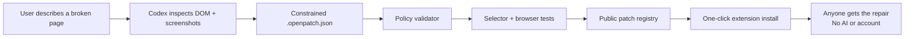
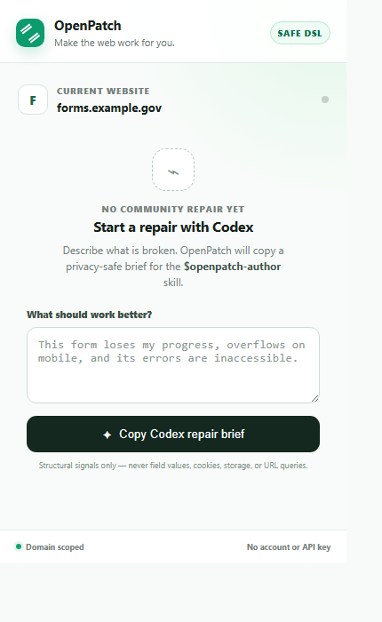

# OpenPatch

**Fix the web you have.**

OpenPatch is a safe, public feature layer for websites users do not own. A user shows Codex a missing capability or inaccessible workflow and gets a constrained, domain-scoped patch. Everyone else can install that community upgrade with one click—without AI, an account, or an API key.

Built for OpenAI Build Week 2026 with Codex and GPT‑5.6.

**Live product:** [openpatch-tau.vercel.app](https://openpatch-tau.vercel.app/) · [Flagship MetroCare demo](https://openpatch-tau.vercel.app/care/) · [CivicApply repair](https://openpatch-tau.vercel.app/demo/) · [Public registry](https://openpatch-tau.vercel.app/registry/index.json)

## The demo

The flagship MetroCare demo is deliberately not a broken toy. It is a credible healthcare directory that works as its owner designed it—but forces a person to inspect twelve cards to compare access, language, availability, and type of care. The site is missing the feature that person actually needs.

OpenPatch’s community patch adds a complete service navigator using ten declarative operations:

- Search existing services using only declared `data-*` attributes
- Combine type-of-care, access, language, and availability filters
- Reduce “wheelchair access + Urdu + accepting new patients” to one matching provider
- Announce result counts through an ARIA live region
- Support `/` to focus search and Escape to clear
- Preserve only the user’s filter preferences locally for 24 hours
- Send no filter, page, or health data over the network
- Improve the desktop and 390px workflow without replacing the portal’s real links

The original CivicApply proof remains in the registry as a second repair. Its 19 constrained operations repair mobile layout, save non-sensitive form progress, restore drafts after a simulated reset, add accessible validation and keyboard navigation, move human help into the workflow, and remove an obstructive survey.

On any page without a community patch, the extension can also create a **privacy-safe Repair Brief** for Codex. It includes the exact origin and path, viewport geometry, structural counts, accessibility signals, and bounded selector candidates—but never field values, cookies, storage, URL queries, or page text.

OpenPatch v0.4 closes the community loop and proves safe feature augmentation: download any `.openpatch.json`, open its target page, and choose the file in the extension. Before installation, the extension validates the DSL, confirms the current URL is in scope, preflights every operation against the live DOM, computes a SHA-256 receipt, displays the exact capabilities, and requests Chrome access only for the declared domains. A failed selector or policy check blocks installation.

The flagship validator reports **10/10 healthy operations**, **8/8 publication assertions**, and SHA-256 receipt `e984431ee1d653eb214429badac793417a9c3d82c9ac9d10b910ae48512fd038`. Local filter preferences expire automatically after 24 hours.

| Before — twelve cards and no way to express a need | After — one private, accessible match |
| --- | --- |
|  |  |

## Why this is different

User-script tools can already inject arbitrary JavaScript. OpenPatch deliberately cannot.



The patch language supports eight capabilities: bounded collection filtering, allowlisted styles, safe attributes, explicit hiding, same-page reorganization, non-sensitive form persistence, local validation, and keyboard navigation. It has no operation for scripts, patch-authored HTML, network requests, cookies, or cross-origin data. The trusted collection navigator can read only explicitly declared `data-*` attributes, never page text or field values.

## Judge quick start

Requirements for the public demo: Chrome/Chromium 120+. No build, account, credential, or API key is required.

Prebuilt artifacts:

- [OpenPatch extension v0.4.0](https://openpatch-tau.vercel.app/downloads/openpatch-extension-v0.4.0.zip) — load-unpacked Chrome extension
- [OpenPatch Codex plugin v0.3.0](https://openpatch-tau.vercel.app/downloads/openpatch-codex-plugin-v0.3.0.zip) — validated authoring plugin
- Extension SHA-256: `9FA8855E3C4154D8EDDEDB08A6E1CC0027B2114B0E42A70F49AD235A8EDE6A39`
- Plugin SHA-256: `02F08D07A3130F6241189F75123C616504C13970B4C973B5A6358EFAAC9C3D3E`

Then:

**Zero-install judge preview:** open [the live MetroCare demo](https://openpatch-tau.vercel.app/care/) and choose **Preview OpenPatch instantly**. This invokes the same constrained runtime and reports `10/10 healthy`; the steps below verify the real extension distribution path.

1. Download and unzip the public extension artifact above.
2. Open `chrome://extensions`, enable **Developer mode**, choose **Load unpacked**, and select the unzipped folder.
3. Open [the live MetroCare demo](https://openpatch-tau.vercel.app/care/).
4. Observe twelve services and no search or filters—the directory works, but cannot express a person’s combined needs.
5. Open the OpenPatch extension and enable **MetroCare: personal service navigator**.
6. Choose **Wheelchair access**, **Urdu**, and **Accepting new patients**. The directory reduces to Harbor Family Clinic and announces `1 of 12 services match`.
7. Reload to see the preferences restored locally; press `/` to focus search. The automated test also proves those interactions make zero network requests.

No account, test credential, API key, or external service is required.

For local development only:

```bash
npm install
npm run build
npm run dev -- --port 5173
```

### Test the Codex authoring path

1. Open any normal website tab that does not have a bundled repair.
2. Open OpenPatch and describe the problem in **Start a repair with Codex**.
3. Choose **Copy Codex repair brief**.
4. Open this repository in Codex and paste the brief. Codex auto-discovers `$openpatch-author` from `.agents/skills/openpatch-author`.

The same skill is packaged as a distributable Codex plugin under `plugins/openpatch`. The extension performs no model call; GPT‑5.6 operates through the user's existing Codex session only while a repair is authored.



### Test community installation

1. Open the registry home page and choose **Download safe patch**.
2. Open the patch's target page.
3. Open OpenPatch, choose the downloaded `.openpatch.json` under **Install or update a community patch**, and inspect the policy, scope, selector-health, and SHA-256 receipt.
4. Choose **Install and activate repair**, approve Chrome's exact-domain prompt, and watch the page reload with the repair active.

Imported patches are stored locally, run through the same constrained runtime, and can replace an older version only when their semantic version is equal or newer. Invalid stored entries are ignored rather than executed.

### Supported platforms

- Extension: Chrome/Chromium 120+ on Windows, macOS, and Linux; the release candidate is tested with Playwright Chromium.
- Authoring skill: ChatGPT desktop Codex, Codex CLI, and the Codex IDE extension on platforms that support repository skills.
- Demo and registry: any modern browser; no account, login, API key, or test data required.

## Verification

```bash
npx tsc --noEmit
npm test
npm run validate:patch
npm run test:browser
npm run test:extension
npm run build
# or run the entire release gate:
npm run verify
```

Current results:

- 31/31 unit, policy, registry, preflight, runtime, and privacy tests pass
- 12/12 desktop and 390px browser journeys pass, including the zero-install judge preview
- 4/4 Manifest V3 extension integration tests pass with a dynamically installed patch plus both real public demo domains
- 10/10 flagship constrained operations apply; 19/19 CivicApply operations remain healthy
- 8/8 flagship publication assertions pass; 10/10 CivicApply assertions remain healthy
- Production site and Manifest V3 extension build successfully
- Public `/registry/index.json` and versioned patch download are generated with a SHA-256 receipt

Browser tests prove both product claims: MetroCare starts as a realistic but filterless directory, then privately combines access needs, persists preferences, announces results, supports the keyboard, fits mobile, and emits no interaction requests; CivicApply still proves layout repair, local draft restoration, specific accessible errors, and arrow-key focus movement.

## Repository map

```text
.agents/skills/openpatch-author/ Codex patch-authoring workflow, auto-discovered in this repo
plugins/openpatch/               Distributable Codex plugin package
src/core/                      DSL types, domain matcher, validator, runtime
src/extension/                 Manifest V3 content script, popup, service worker
src/registry/patches/          Versioned community patches
src/site/                      Registry landing page, MetroCare flagship, and CivicApply demo
tests/                         Security, runtime, and browser tests
scripts/                       Build, validation, and preview tooling
```

## Safe transformation DSL

Every patch declares an exact host/path scope, plain-language capabilities, constrained operations, assertions, version, and changelog.

```json
{
  "schemaVersion": 1,
  "id": "org.openpatch.civicapply-accessible-draft",
  "match": {
    "hosts": ["localhost", "127.0.0.1", "openpatch-tau.vercel.app"],
    "paths": ["/demo/*"]
  },
  "capabilities": ["local-storage", "validation"],
  "operations": [
    {
      "id": "persist-draft",
      "type": "persistForm",
      "selector": "#benefits-form",
      "key": "housing-support-draft-v1",
      "include": ["input", "select", "textarea"],
      "ttlMinutes": 1440,
      "statusText": "Draft saved on this device for 24 hours"
    }
  ]
}
```

The validator rejects unknown operations, event-handler attributes, network-capable CSS, broad document selectors, malformed scopes, undeclared capabilities, duplicate IDs, excessive operation counts, and sensitive persistence patterns. The runtime adds its own exclusions for password, file, authentication-code, payment, hidden, disabled, and submit fields.

See [`src/core/validator.ts`](src/core/validator.ts) for executable policy and [`.agents/skills/openpatch-author/references/dsl.md`](.agents/skills/openpatch-author/references/dsl.md) for the authoring reference.

## Codex collaboration

This project was created during the Build Week submission period in a single core Codex thread.

**Human product decisions:** the public repair-layer concept; the no-API-key distribution model; a deliberately constrained DSL instead of user scripts; the choice to demonstrate a public-benefits workflow; and the focus on agency, accessibility, and community reuse.

**Where GPT‑5.6 through Codex accelerated the work:** translating the concept into a judge-focused vertical slice; scaffolding the Manifest V3 extension and public registry; implementing and threat-modeling the DSL; authoring the CivicApply repair; building the privacy-safe extension-to-Codex Repair Brief; packaging the official repo skill and plugin; building unit and browser tests; running responsive visual QA; and turning browser failures into concrete layout and test-fixture fixes.

**Key joint tradeoff:** the hackathon MVP publishes one real, fully tested community patch instead of pretending a production-scale catalog already exists. The registry is a genuine machine-readable endpoint with a version, scope, downloadable patch, operation/assertion counts, and SHA-256 receipt; the extension can now validate and install downloaded community patches on their exact domains. Automatic remote discovery, publisher signing, moderation, and revocation remain explicit next milestones.

Before final Devpost submission, the project thread's `/feedback` Codex Session ID will be added to the submission as required.

## Security model

OpenPatch treats patches, websites, registry metadata, and page content as untrusted.

- Exact host and narrow path matching happens before execution.
- Imported patches are policy-validated and live-selector-preflighted before Chrome requests exact-domain access.
- Operations are parsed into typed built-ins; patch code is never evaluated.
- CSS properties and attributes use allowlists.
- Critical singleton targets fail closed when selector counts drift.
- Every operation emits health data for breakage detection.
- Local draft storage stays on the page origin and excludes sensitive fields.
- Community permissions are displayed before activation.
- Patches never replace the site's actual authentication, submission, or server validation.
- Repair Briefs exclude values, cookies, storage, query strings, and page text before anything is copied to Codex.

The current MVP bundles one default repair and supports validated local installation from the public registry. Automatic registry sync, publisher signatures, moderation, and revocation are explicit next milestones.

## License

MIT. See [LICENSE](LICENSE).
