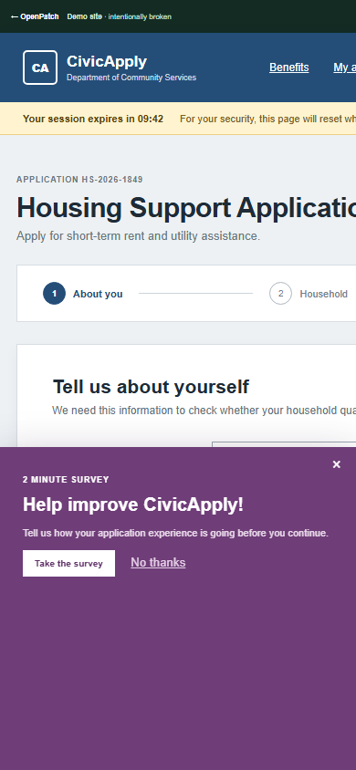
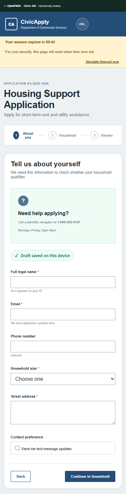
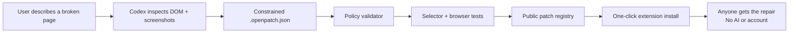

# OpenPatch

**Fix the web you have.**

OpenPatch is a safe, public repair layer for websites users do not own. A user shows Codex a broken page, describes the problem, and gets a constrained, domain-scoped patch. Everyone else can install that community repair with one click—without AI, an account, or an API key.

Built for OpenAI Build Week 2026 with Codex and GPT‑5.6.

## The demo

The bundled CivicApply portal recreates a familiar high-stakes failure: a public-benefits form that overflows on mobile, loses unfinished progress, reports generic inaccessible errors, and is covered by a survey.

OpenPatch applies 19 declarative operations that:

- Repair the complete 390px mobile layout
- Preserve non-sensitive form progress in origin-local storage
- Restore a draft after a simulated session reset
- Add specific accessible validation with `aria-invalid` and `aria-describedby`
- Add arrow-key navigation to the progress controls
- Move help into the application workflow
- Remove the blocking survey and contradictory native save state

The validator reports **19/19 healthy operations** and a SHA-256 publication receipt.

| Before — fixed-width form and blocking survey | After — repaired, accessible, locally saved |
| --- | --- |
|  |  |

## Why this is different

User-script tools can already inject arbitrary JavaScript. OpenPatch deliberately cannot.



The patch language supports seven capabilities: allowlisted styles, safe attributes, explicit hiding, same-page reorganization, non-sensitive form persistence, local validation, and keyboard navigation. It has no operation for scripts, HTML injection, network requests, cookies, or cross-origin data.

## Judge quick start

Requirements: Node.js 22+ and Chrome/Chromium.

```bash
npm install
npm run build
npm run dev -- --port 5173
```

Then:

1. Open `chrome://extensions` and enable **Developer mode**.
2. Choose **Load unpacked** and select `dist/extension`.
3. Open `http://localhost:5173/demo/`.
4. Try the broken form at a narrow viewport, enter sample data, and choose **Simulate timeout now**.
5. Open the OpenPatch extension and enable **CivicApply: accessible & autosaved**.
6. Enter sample data again, simulate another timeout, and watch the patch restore it.
7. Submit an invalid email to see the accessible error, then focus a progress step and use the arrow keys.

No account, test credential, API key, or external service is required.

## Verification

```bash
npx tsc --noEmit
npm test
npm run validate:patch
npm run test:browser
npm run build
```

Current results:

- 8/8 unit tests pass
- 4/4 desktop and 390px browser tests pass
- 19/19 constrained operations apply
- 4/4 publication assertions pass
- Production site and Manifest V3 extension build successfully

Browser tests prove both states: the original portal must be broken, and the patched portal must fit the viewport, restore a local draft after reload, expose specific accessible errors, and support arrow-key focus movement.

## Repository map

```text
.codex/skills/openpatch-author/  Codex patch-authoring workflow
src/core/                      DSL types, domain matcher, validator, runtime
src/extension/                 Manifest V3 content script, popup, service worker
src/registry/patches/          Versioned community patches
src/site/                      Registry landing page and CivicApply demo
tests/                         Security, runtime, and browser tests
scripts/                       Build, validation, and preview tooling
```

## Safe transformation DSL

Every patch declares an exact host/path scope, plain-language capabilities, constrained operations, assertions, version, and changelog.

```json
{
  "schemaVersion": 1,
  "id": "org.openpatch.civicapply-accessible-draft",
  "match": {
    "hosts": ["localhost", "127.0.0.1"],
    "paths": ["/demo/*"]
  },
  "capabilities": ["local-storage", "validation"],
  "operations": [
    {
      "id": "persist-draft",
      "type": "persistForm",
      "selector": "#benefits-form",
      "key": "housing-support-draft-v1",
      "include": ["input", "select", "textarea"],
      "statusText": "Draft saved on this device"
    }
  ]
}
```

The validator rejects unknown operations, event-handler attributes, network-capable CSS, broad document selectors, malformed scopes, undeclared capabilities, duplicate IDs, excessive operation counts, and sensitive persistence patterns. The runtime adds its own exclusions for password, file, authentication-code, payment, hidden, disabled, and submit fields.

See [`src/core/validator.ts`](src/core/validator.ts) for executable policy and [`.codex/skills/openpatch-author/references/dsl.md`](.codex/skills/openpatch-author/references/dsl.md) for the authoring reference.

## Codex collaboration

This project was created during the Build Week submission period in a single core Codex thread.

**Human product decisions:** the public repair-layer concept; the no-API-key distribution model; a deliberately constrained DSL instead of user scripts; the choice to demonstrate a public-benefits workflow; and the focus on agency, accessibility, and community reuse.

**Where Codex accelerated the work:** translating the concept into a judge-focused vertical slice; scaffolding the Manifest V3 extension and static registry; implementing and threat-modeling the DSL; authoring the CivicApply repair; building unit and browser tests; running responsive visual QA; and turning browser failures into concrete layout and test-fixture fixes.

**Key joint tradeoff:** the hackathon MVP bundles one real, fully tested community patch instead of pretending a production-scale registry already exists. The versioned patch format, health model, authoring skill, and extension boundaries are designed so that registry sync and publisher signing can be added without changing what a patch is allowed to do.

Before final Devpost submission, the project thread's `/feedback` Codex Session ID will be added to the submission as required.

## Security model

OpenPatch treats patches, websites, registry metadata, and page content as untrusted.

- Exact host and narrow path matching happens before execution.
- Operations are parsed into typed built-ins; patch code is never evaluated.
- CSS properties and attributes use allowlists.
- Critical singleton targets fail closed when selector counts drift.
- Every operation emits health data for breakage detection.
- Local draft storage stays on the page origin and excludes sensitive fields.
- Community permissions are displayed before activation.
- Patches never replace the site's actual authentication, submission, or server validation.

The current MVP bundles its registry entry with the extension. Production registry transport, publisher signatures, moderation, and revocation are explicit next milestones.

## License

MIT. See [LICENSE](LICENSE).
